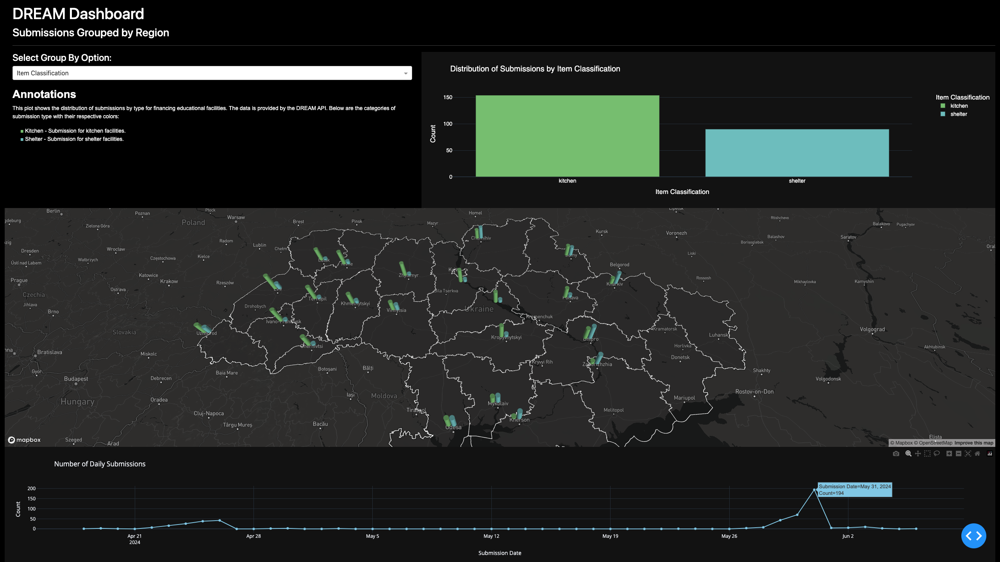

## README

# DREAM Dashboard

The DREAM Dashboard provides an interactive visualization of submissions for financing educational facilities, grouped by region. This dashboard helps users to explore and analyze the data based on various parameters, offering insights into the distribution of submissions and funding requests.

## Screenshots


## Project Structure

```plaintext
final_project
│
├── data
│   ├── .gitkeep                         # Keeps the directory in version control
│   ├── regions_geocoded.csv             # CSV file with geocoded region data
│   ├── submissions.csv                  # Raw submissions data
│   ├── submissions_geocoded.csv         # Submissions data with geocoded information
│   ├── submissions_golden.csv           # Cleaned and processed submissions data (golden version)
│   ├── submissions_silver.csv           # Intermediate processed submissions data (silver version)
│
├── notebooks
│   ├── .ipynb_checkpoints               # Checkpoints for Jupyter notebooks
│   └── data_engineering
│       ├── bronze.ipynb                 # Notebook for initial data processing (bronze level)
│       ├── golden.ipynb                 # Notebook for final data processing and cleaning (golden level)
│       └── silver.ipynb                 # Notebook for intermediate data processing (silver level)
│
├── src
│   ├── app.py                           # Main application file for the Dash app
│   └── wsgi.py                          # WSGI entry point for deployment
│
├── .env                                 # Environment variables file
├── .gitignore                           # Git ignore file
├── poetry.lock                          # Poetry lock file for dependencies
├── pyproject.toml                       # Poetry configuration file
└── README.md                            # Project README file
```

## Environment Variables

Create a `.env` file in the root directory with the following parameters:

```plaintext
GCP_API_KEY=
GMAPS_API_KEY=
MAPBOX_API_KEY=
```

These API keys are required for integrating Google Maps and Mapbox functionalities.

## Technologies Used

- **Dash**: For building the interactive web application.
- **Plotly**: For creating the bar plots and line charts.
- **PyDeck**: For creating the map visualizations.
- **Google Maps**: For geocoding the latitude and longitude.
- **Mapbox**: For providing the map background in the PyDeck visualizations.
- **Poetry**: For package management.

## Installation

To install the required packages, use Poetry. 
Be sure you have a poetry installed already, which you can install with `brew`
```bash
brew install poetry
```
Navigate to the project directory and run:
```bash
poetry install
```

## Application Deployment

The application is deployed on PythonAnywhere. You can access the live dashboard at the following link:
\[PLACEHOLDER FOR LINK\]

## Dashboard Overview



The dashboard includes the following components:

1. **Dropdown Menu**: Allows users to select the grouping option (Item Classification or Submission Status).
2. **Annotations Section**: Provides information about the selected grouping option.
3. **Bar Plot**: Displays the distribution of submissions based on the selected grouping option.
4. **Map**: Shows the geographic distribution of submissions.
5. **Time-Series Chart**: Displays the number of daily submissions over time.

## Insights from the Data

### 1. Distribution of Submissions by Item Classification
The bar plot on the top right shows the distribution of submissions classified by item type (kitchen and shelter). This visualization helps in understanding the types of facilities most commonly requested.

### 2. Geographic Distribution of Submissions
The map in the center shows the geographic distribution of submissions, allowing users to see which regions have the highest number of submissions and their classification.

### 3. Time-Based Patterns
The line chart at the bottom shows the number of daily submissions, helping to identify any temporal patterns or deadlines in the submission process.

## Limitations

The current implementation has limited interactivity. The bar plot and line chart are not interconnected with the map due to technical constraints. PyDeck requires the map data to be in JSON format, making it challenging to dynamically update the map based on user interactions with the other charts.

## Data Questions Addressed

1. **What is the distribution of submissions by item classification?**
   - This question is answered by the bar plot, which shows the count of kitchen and shelter submissions.

2. **Which region produced the most applications? Are there any differences between regions in terms of their needs (e.g., kitchen vs shelter)?**
   - The map visualization provides insights into the regional distribution of submissions and their classifications.

3. **Are there any time-based patterns?**
   - The line chart at the bottom of the dashboard displays the number of daily submissions, helping to identify patterns over time.

Feel free to explore the dashboard and gain insights from the data! If you have any questions or need further assistance, please contact [Your Contact Information].

## Consideration of Alternative Tools

While PyDeck was used for its ability to create 3D bar plots on maps, it presented challenges in terms of interactivity and integration with other plots. Altair could be a better alternative due to its simpler integration and interactivity features. However, those two libs has its own pros and cons:

- Pros: Easier integration, better interactivity, and declarative syntax.
- Cons: Limited support for 3D visualizations, which was the primary reason for choosing PyDeck.

## More Examples


